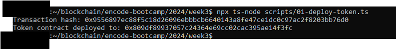
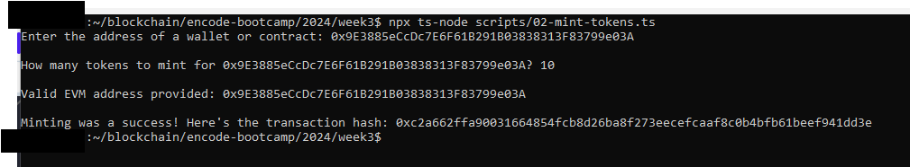
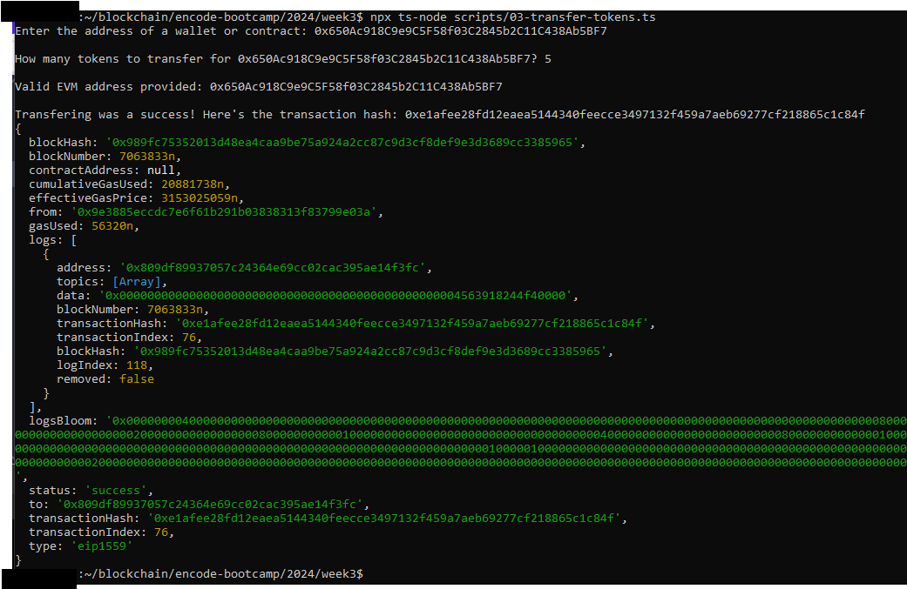
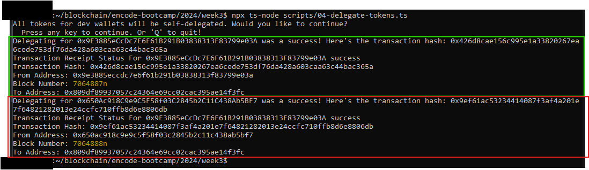
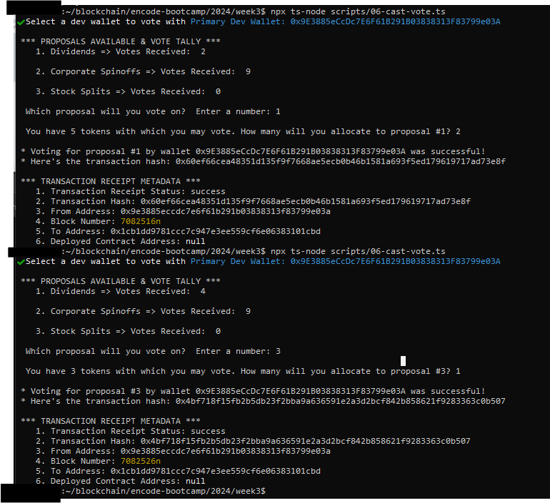
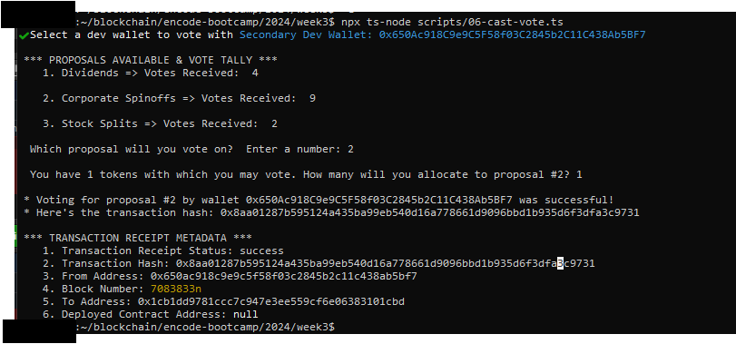
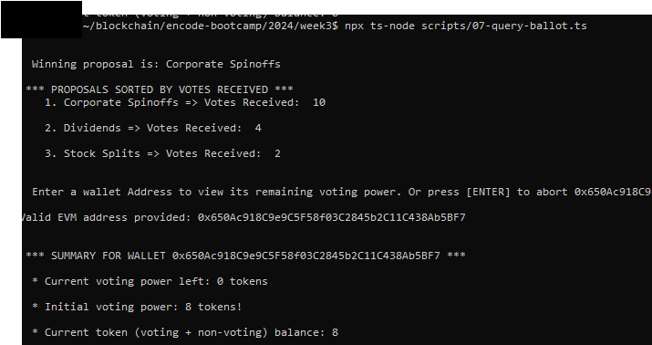

# Encode Club EVM Bootcamp Group 2, Assignment 3: Tokenzied Ballots

- [Encode Club EVM Bootcamp Group 2, Assignment 3: Tokenzied Ballots](#encode-club-evm-bootcamp-group-2-assignment-3-tokenzied-ballots)
- [Overview: Tokenzied Ballots](#overview-tokenzied-ballots)
  - [Assignment](#assignment)
  - [Key Learnings](#key-learnings)
    - [TypeScript Rules \& Cheat Sheet](#typescript-rules--cheat-sheet)
    - [How to Act as Another Wallet within the Hardhat Runtime Environment (HRE)](#how-to-act-as-another-wallet-within-the-hardhat-runtime-environment-hre)
    - [Instantiating Multiple User Wallets on Live EVMs](#instantiating-multiple-user-wallets-on-live-evms)
    - [Viem Suggest Simulating Write Transactions Before Executing Live](#viem-suggest-simulating-write-transactions-before-executing-live)
    - [How to Read User Input from Command line Using Node's Built-in `readline` Module](#how-to-read-user-input-from-command-line-using-nodes-built-in-readline-module)
    - [Viem Core Smart Contract Functions](#viem-core-smart-contract-functions)
    - [Save Data to a JSON File with Nodejs](#save-data-to-a-json-file-with-nodejs)
    - [Wei 101](#wei-101)
- [Project Set-up, Tx Hashes, and Screenshots](#project-set-up-tx-hashes-and-screenshots)
- [Future Upgrades](#future-upgrades)
  - [TypeScript and nodejs: Append data to a json file from command line](#typescript-and-nodejs-append-data-to-a-json-file-from-command-line)
- [Appendix](#appendix)

# Overview: Tokenzied Ballots

Okay boys and girls. Our group is very independent. So everyone has opted to do their homework solo.  As such, this repo embodies my interpretation of as well as my key learnings from the assignment. 

## Assignment

For this weekend's project, [@codesport](https//github.com/codesport) has:

1. Customized the original Ballot.sol to a `[TokenizedBallot.sol](contracts/TokenizedBallots.sol)`.  This new ballot contract uses token ownership at a `block.number`-based snapshot to gauge voting power

2. Created [nodejs scripts](scripts) which allow users to perform the following:

* Deploy an [ERC20Votes](contracts/TokenizedVotes.sol) contract from OpenZeppellin's [contract's wizard](https://wizard.openzeppelin.com/)
* The token's name and symbol were customized as follows: `constructor() ERC20("VoteToken", "VTK") ERC20Permit("VoteToken")`

* Mint (via ERC20's `onlyRole(MINTER_ROLE)`) tokens to others
* "Delegate" (i.e., transfer) [voting power](https://docs.openzeppelin.com/contracts/5.x/api/governance#Votes-delegate-address-) by sending tokens to another wallet  
  * "Delegated" (i.e., transferred) tokens must always be "activated" by self-delegating those received tokens
* Deploy a TokenizeBallot.sol which allows voting, vote tracking, and "connects" to TokenizedVotes.sol via a Solidity Interface
* Verify vote power and Cast votes
   
* Query various voting and proposal results


## Key Learnings

### TypeScript Rules & Cheat Sheet


* No Need to Declare Typings When Declaring Constants
* All variables must be initialized with a value:
    * `let myVariable: number | string | any | [] | {} | = 123;`
      - where: `|` is TypeScript syntax for "OR"
* Cheat sheet 1: https://learnxinyminutes.com/docs/typescript/
* Cheat sheet 2: https://www.typescriptlang.org/docs/handbook/2/objects.html

### How to Act as Another Wallet within the Hardhat Runtime Environment (HRE)

There are two way to do this.

Method one has two parts. First, instantiate a new wallet client object: 

```
    const user1Connector = await viem.getContractAt(
        CONTRACT2, //contract name defined in contract
        BallotContract.address,
        {client: {wallet: user1}}
    );
```
Second, attach the object to the transaction call within the HRE: `voteHash = await user1Connector.write.vote([ 1, parseEther("3")  ]);`

Method 2 is simpler. It only requires specifying the other account as an argument to the write call: `voteHash = await BallotContract.write.vote([ 2, user1VotingPower], { account: user1.account,  } );`. NB: During script setup, HRE wallets are assigned via variable destructuring: `const [deployer, user1, user2, user3] = await viem.getWalletClients();`

### Instantiating Multiple User Wallets on Live EVMs

`account` is a Viem keyword used in wallet-client setup up.  So, we may set it as a variable so its value may be reassigned at will by setting it as a variable `let account1 = privateKeyToAccount(`0x${process.env.PRIVATE_KEY}`); // initial assignment where 'account' is a Viem keyword`

However, a better is to use `key:value` notation in the wallet object creation:

Config file excerpt:
```
// Create primary wallet client (deployer) account

const walletClient = createWalletClient({
    account: privateKeyToAccount(`0x${process.env.FIRST_PRIVATE_KEY}`);
    chain: sepolia,
    transport: http(ETH_SEPOLIA_RPC_URL_1),
});

// Create secondary wallet client (end-user) account

const secondaryWalletClient = createWalletClient({
    account: privateKeyToAccount(`0x${process.env.PRIVATE_KEY}`);
    chain: sepolia,
    transport: http(ETH_SEPOLIA_RPC_URL_1),
});
```


Executable file excerpt:
```
const [ primaryWallet ] = await walletClient.getAddresses() 
const [  secondaryWallet ]  = await secondaryWalletClient.getAddresses() 

```


Several lines of code afterwords, connect to wallet clients, like so:

```
let hash = await primaryWallet.writeContract({
    address: readKeyValue('tokenAddress') as `0x${string}`,
    abi: abi,
    functionName: 'delegate',
    args: [ primaryWallet ]

})

...

hash = await secondaryWalletClient.writeContract({
    address: readKeyValue('tokenAddress') as `0x${string}`,
    abi: abi,
    functionName: 'delegate',
    args: [ secondaryWallet  ]
})  

```


### Viem Suggest Simulating Write Transactions Before Executing Live


https://viem.sh/docs/contract/writeContract.html

```
/**
* Pair writeContract with simulateContract to validate that the contract write will execute without errors.
* @see https://viem.sh/docs/contract/writeContract.html#usage
*/
let { request } = await publicClient.simulateContract({  // 'request' is also a Viem keyword. So, set as variable to reassign
    account: primaryWallet,
    address: readKeyValue('tokenAddress') as `0x${string}`,
    abi: abi,
    functionName: 'delegate',
    args: [ account ]
})
// console.log( request);


//NB: TS requires that statement is surrounded with '( )'
(  { request } =  await publicClient.simulateContract({ // reassign the 'request' object
    account: secondaryWallet,
    address: readKeyValue('tokenAddress') as `0x${string}`,
    abi: abi,
    functionName: 'delegate',
    args: [ account ]
}) )
```

The  Viem docs suggest using `const hash = await walletClient.writeContract(request)` after the simulation is successful. However, this produced an RPC error within the Alchemy and Infura RPC APIs.  The error mentioned something about not having access to the account's private key.


1. **Alchemy**
```
 Details: {"code":-32600,"message":"Unsupported method: eth_sendTransaction. See available methods at https://docs.alchemy.com/alchemy/documentation/apis"}
 ```

2. **Infura:**  `Details: The method eth_sendTransaction does not exist/is not available`
  

### How to Read User Input from Command line Using Node's Built-in `readline` Module

```
import * as readline from 'readline'

/**
 * Continue or abort script via based on user input
 *
 * - CLI function to verify user inputs. depends on `import * as readline from "readline";`
 * - call from within another async function
 * - https://www.google.com/search?q=when+and+why+use+promise.all?
 * - https://www.google.com/search?q=when+to+use+promise.all
 * - https://www.google.com/search?q=use+node+to+prompt+user+input+from+command+line
 * - In TypeScript: https://www.google.com/search?q=TypeScript%3A+use+node+to+prompt+user+input+from+command+line?
 * - Boss Mode: https://github.com/SBoudrias/Inquirer.js
 *
 * @param message - The confirmation message.
 * @returns Promise resolving to true if confirmed, false otherwise.
 * @see https://stackoverflow.com/a/61395541
 *
 * Usage:
 *
 *  const isConfirmed = await confirmAction('Would you like to continue? ');
 *   if (isConfirmed === false) { 
 *      console.log("Operation cancelled by the user.");
 *       process.exit(0);
 *   }
 */
const confirmAction = async (message: string): Promise<boolean> => {
    const rl = readline.createInterface({
        input: process.stdin,
        output: process.stdout,
    });

    return new Promise((resolve) => {
        rl.question(`${message} \n  Press any key to continue. Or 'Q' to quit! `, (answer) => {
            rl.close();
            //resolve(answer.trim().toLowerCase() === "y");
            resolve(answer.trim().toLowerCase() !== "q");
        });
    });
}
```

### Viem Core Smart Contract Functions

1. [Read Contract](https://viem.sh/docs/contract/readContract.html): `await publicClient.readContract({...})`

1. [Deploy Contract](https://viem.sh/zksync/actions/deployContract): `await walletClient.deployContract({...})`

1. [Simulate Contract](https://viem.sh/zksync/actions/deployContract): `await publicClient.simulateContract({...})`

1. [Write Contract](https://viem.sh/zksync/actions/deployContract): `await walletClient.writeContract({...})`


### Save Data to a JSON File with Nodejs

Create New File (or Overwrite existing) and Save Save Data:
`fs.writeFileSync(contractAddressStoragePath, JSON.stringify(variables));`

* Read Existing File
```
/**
 * 
 * 
 * @see https://www.google.com/search?q=TypeScript+and+nodejs%3A+read+a+key+value+pair+from+json+file+and+save+to+variable
 * @param key 
 * @returns value
 */
function readKeyValue(/*filePath: string,*/ key: string): string | undefined { //data-type can also be :any intstad of string
    try {
        /**
        * readFileSync reads the file synchronously. The event loop and execution of the remaining code is blocked 
        * until all the data has been read.
        */
        const jsonData = JSON.parse( fs.readFileSync(contractAddressStoragePath, 'utf-8') );
        return jsonData[key];
    } catch (error) {
        console.error('Error reading JSON file:', error);
        return undefined;
        //   // If the file doesn't exist, create an empty object
        //   if (err.code === 'ENOENT') {
        //     jsonData = {};
        //   } else {
        //     throw err;
        //   }

    }
}
```

* Append Data to Existing File

```
/**
 *
 *
 * @see https://www.google.com/search?q=TypeScript%3A+use+node+to+append+data+to+a+json+file+from+command+line
 * @param keyValue 
 * @returns 
 */
function appendKeyValue(/*filePath: string,*/ keyValue: any): any | undefined {

    let jsonData: any = {}
    try {
        const fileContent = fs.readFileSync(contractAddressStoragePath, 'utf-8');
        jsonData = JSON.parse(fileContent);
        Object.assign(jsonData, keyValue);
        fs.writeFileSync(contractAddressStoragePath, JSON.stringify(jsonData, null, 4));
    } catch (error) {
        console.error('Error reading JSON file:', error);
        return undefined;
    }
}
```

### Wei 101

Wei is the smallest divisible unit for Ether. 

Cents is the smallest divisible unit for US dollars.

* $1.00 = 100 cents
* 1  ETH = 1x10^18 wei = 1x10^9 Gwei
* when sending or storing ERC20 coins in smart contracts we do it decimal units.  So we store  1 ETH in wei ===  1 * 10 ** 18 .  Therefore,
   *  0.1 ETH = 1 * 10  **  17 
   *  0.5 ETH = 5 * 10  **  17 
   *  0.05 ETH = 5 * 10 ** 16


# Project Set-up, Tx Hashes, and Screenshots


1. Create and run prelim scripts inside the HRE. These are not unit tests, but rather dry-runs within the HRE: 
    ```
    pnpm hardhat run test/TokenizedBallot.ts
    ```
2. Create files for our TS scripts:
    ```
    cd scripts
    touch 01-deploy-token.ts 02-mint-tokens.ts 03-transfer-tokens.ts 04-delegate-tokens.ts 05-deploy-ballot.ts
    ```
3. Token Deployed tx hash: [0x9556897ec88f5c18d26096ebbbcb6640143a8fe47ce1dc0c97ac2f8203bb76d0](https://sepolia.etherscan.io/tx/0x9556897ec88f5c18d26096ebbbcb6640143a8fe47ce1dc0c97ac2f8203bb76d0)
    

4. First Token mint of 10 tokens to wallet 1: https://sepolia.etherscan.io/tx/0xc2a662ffa90031664854fcb8d26ba8f273eecefcaaf8c0b4bfb61beef941dd3e
    

5. Transfer of 5 tokens to wallet 2: https://sepolia.etherscan.io/tx/0xe1afee28fd12eaea5144340feecce3497132f459a7aeb69277cf218865c1c84f
    

6. First self-delegating tokens to wallets 1 and 2: 
    * [Wallet 1 Self-Delegation](https://sepolia.etherscan.io/tx/0x426d8cae156c995e1a33820267ea6cede753df76da428a603caa63c44bac365a)
    * [Wallet 2 Self-Delegation](https://sepolia.etherscan.io/tx/0x9ef61ac53234414087f3af4a201e7f64821282013e24ccfc710ffb8d6e8806db) 
       * 

7.   Second and third token mints tx of tokens to:
     * [Mint 5 tokens to Wallet 1](https://sepolia.etherscan.io/tx/0x84e49e4961776688429e6f6ea81675d246e53906a67e104764d6ee71b7245d2c)
     * [Mint 3 tokens to Wallet 2](https://sepolia.etherscan.io/tx/0x439ac5d284e0a21c7338d90a866db1347b9d2579d8f8498084ec2215abaa7be5)  

8. Second self-delegating tokens to Wallets 1 and 2: 
    * [Wallet 1 Self-Delegation](https://sepolia.etherscan.io/tx/0x426d8cae156c995e1a33820267ea6cede753df76da428a603caa63c44bac365a)
    * [Wallet 2 Self-Delegation](https://sepolia.etherscan.io/tx/0xc3b9ea77a44661f1b16fd3c4c07c26060bcc1be28c25b1e4f15bc4ef2aba1809)

9.  TokenizedBallot.sol deploy tx hash: [0xc3f088750fb1f0ab86fffb7028ca95401f60729442ad2c71c2c3d3bae647d03a](https://sepolia.etherscan.io/tx/0xc3f088750fb1f0ab86fffb7028ca95401f60729442ad2c71c2c3d3bae647d03a)

10. Casting Votes
    * 
    * 

11. Querying Ballot results
    * 


# Future Upgrades

## TypeScript and nodejs: Append data to a json file from command line

Combine initial file write function into the append function s.t. original file is never overwritten if it already exists

This solution was provided by [Google's AI](https://www.google.com/search?q=TypeScript+and+nodejs%3A+Append+data+to+a+json+file+from+command+line)

```
// append.ts
import * as fs from 'fs';

const dataToAppend = process.argv[2]; // Get the data to append from command line arguments

if (!dataToAppend) {
  console.error("Please provide data to append as a command line argument.");
  process.exit(1);
}

const filePath = 'data.json'; // Replace with your JSON file path

fs.readFile(filePath, 'utf8', (err, data) => {
  if (err) {
    if (err.code === 'ENOENT') {
      // File does not exist, create it with the new data
      const jsonData = [JSON.parse(dataToAppend)];
      fs.writeFileSync(filePath, JSON.stringify(jsonData, null, 2));
      console.log("File created and data appended.");
    } else {
      console.error("Error reading file:", err);
    }
  } else {
    // File exists, parse the JSON and append new data
    try {
      const jsonData = JSON.parse(data);
      jsonData.push(JSON.parse(dataToAppend));

      fs.writeFileSync(filePath, JSON.stringify(jsonData, null, 2));
      console.log("Data appended to file.");
    } catch (parseError) {
      console.error("Error parsing JSON:", parseError);
    }
  }
});
```

# Appendix

1. Online guides to review or delete when I have time:

* https://medium.com/coinmonks/learn-to-deploy-smart-contracts-more-professionally-with-hardhat-1fec1dab8eac#42e2
* https://stackoverflow.com/questions/75004417/why-do-we-need-deployments-fixture
* https://hardhat.org/hardhat-runner/docs/guides/test-contracts
* https://github.com/smartcontractkit/full-blockchain-solidity-course-js/discussions/1674
* https://www.google.com/search?q=what+are+hardhat+fixtures+and+do+the+replace+BeforeEach+in+solidity+tests